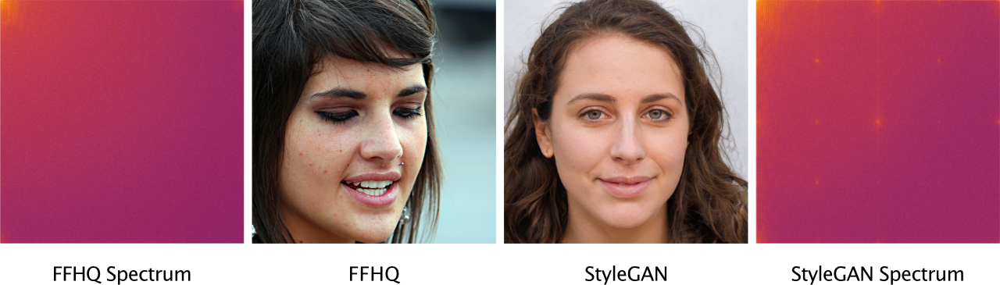
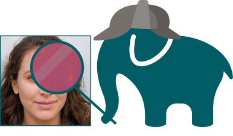

# Leveraging Frequency Analysis for Deep Fake Image Recognition


<p>
 
</p>

This is the code repository accompaning our ICML 2020 paper [Leveraging Frequency Analysis for Deep Fake Image Recognition](https://arxiv.org/abs/2003.08685).

> Deep neural networks can generate images that are astonishingly realistic, 
> so much so that it is often hard for untrained humans to distinguish them from actual photos.
> These achievementshave been largely made possible by Generative Adversarial Networks (GANs). 
> While these deepfake images have been thoroughly investigatedin the image domain—a classical approach from the area of image forensics—an 
> analysis in the frequency domain has been missing. This paper addresses this shortcoming and 
> our results reveal, that in frequency space, GAN-generated images exhibit severe artifacts that 
> can be easily identified. We perform a comprehensive analysis, showing that these artifacts are 
> consistent across different neural network architectures, data sets,and resolutions.
> In a further investigation, we demonstrate that these artifacts are caused by upsampling operations 
> found in all current GAN architectures, indicating a structural and fundamental problem in the way 
> images are generatedvia GANs. Based on this analysis, we demonstrate how the frequency representation 
> can be used to automatically identify deep fake images, surpassing state-of-the-art methods.

## Prerequisites

For ease of use we provide a Dockerfile which builds a container in which you can execute all experiments.
Additionally, we provide a shell script for ease of use:

```
Choose: docker.sh {build|download|convert|shell}
    build - Build the Dockerfile.
    shell - Spawn a shell inside the docker container.
    tests - Spawn Docker instance for pytest.
    clean - Cleanup directories from training.

```

Otherwise you will need a recent Python 3 version, tensorflow 2.0+ with CUDA compatibility. See `requirements.txt` for packages needed.

## Datasets

We utilize these three popular datasets:
*  [CelebA](http://mmlab.ie.cuhk.edu.hk/projects/CelebA.html)
*  [FFHQ](https://github.com/NVlabs/ffhq-dataset)
*  [LSUN bedroom](https://github.com/fyu/lsun)
 

Additionally, we utilize the pre-trained models from these repositories:
* [StyleGAN](https://github.com/NVlabs/stylegan/)
* [GANFingerprints](https://github.com/ningyu1991/GANFingerprints/)


### Dataset preparation

The datasets have to be converted beforehand. First run `crop_celeba.py` or `crop_lsun.py` depending on your dataset. This will create a new folder which has cropped instances of the training data to `128x128`. Then run `prepare_dataset.py`, depending on the mode selection the script expects different input.
Note FFHQ is distributed in a cropped version.

The scripts expects one directory as input, containing multiple directories each with at least 27,000 images.
These directories will get encoded with labels in the order of appearence, i.e., encoded as follows:

```
data
 |--- A_lsun 	-> label 0
 |--- B_ProGAN 	-> label 1
 	...
```
It converts all images to dct encoded numpy arrays/tfrecords, depending on the mode selected. Saving the output in three directories train (100,000), val (10,000) and test (25,000).

```
usage: prepare_dataset.py [-h] [--raw] [--log] [--color] [--normalize]
                          DIRECTORY {normal,tfrecords} ...

positional arguments:
  DIRECTORY           Directory to convert.
  {normal,tfrecords}  Select the mode {normal|tfrecords}

optional arguments:
  -h, --help          show this help message and exit
  --raw, -r           Save image data as raw image.
  --log, -l           Log scale Images.
  --color, -c         Compute as color instead.
  --normalize, -n     Normalize data.

Example:
python prepare_dataset.py ~/datasets/GANFingerprints/perturbed_experiments/lsun/blur/ -lnc normal
```

## Computing Statistics

To compute all of our statistics we utilize the `compute_statistics.py` script. This script is run on the raw (cropped) image files.
```
usage: compute_statistics.py [-h] [--output OUTPUT] [--color]
                             AMOUNT [DATASETS [DATASETS ...]]

positional arguments:
  AMOUNT                The amount of images to load.
  DATASETS              Path to datasets. The first entry is assumed to be the
                        referrence one.

optional arguments:
  -h, --help            show this help message and exit
  --output OUTPUT, -o OUTPUT
                        Output directory. Default: {output_default}.
  --color, -c           Plot for each color channel seperate.
  
Example:
python compute_statistics.py 10000 ~/datasets/ffhq/real,REAL ~/datasets/ffhq/fake,FAKE
```

## Experiments

### Training your own models

After you have converted the data files as laid out above, you can train a new classifier:
```
usage: classifer.py train [-h] [--debug] [--epochs EPOCHS]
                          [--image_size IMAGE_SIZE]
                          [--early_stopping EARLY_STOPPING]
                          [--classes CLASSES] [--grayscale]
                          [--batch_size BATCH_SIZE] [--l1 L1] [--l2 L2]
                          MODEL TRAIN_DATASET VAL_DATASET

positional arguments:
  MODEL                 Select model to train {resnet, cnn, nn, log, log1,
                        log2, log3}.
  TRAIN_DATASET         Dataset to load.
  VAL_DATASET           Dataset to load.

optional arguments:
  -h, --help            show this help message and exit
  --debug, -d           Debug mode.
  --epochs EPOCHS, -e EPOCHS
                        Epochs to train for; Default: 50.
  --image_size IMAGE_SIZE
                        Image size. Default: [128, 128, 3]
  --early_stopping EARLY_STOPPING
                        Early stopping criteria. Default: 5
  --classes CLASSES     Classes. Default: 5
  --grayscale, -g       Train on grayscaled images.
  --batch_size BATCH_SIZE, -b BATCH_SIZE
                        Batch size. Default: 32
  --l1 L1               L1 reguralizer intensity. Default: 0.01
  --l2 L2               L2 reguralizer intensity. Default: 0.01
 
Example:

python classifer.py train log2 datasets/ffhq/data_raw_color_train_tf/data.tfrecords datasets/ffhq/data_raw_color_val_tf/data.tfrecords -b 32 -e 100 --l2 0.01 --classes 1 --image_size 1024
```

### Testing

You can also use our [pre-trained models](https://drive.google.com/open?id=1QjQnqMQnQOoIPwgzdJVJGwYzdReKqc0N).

```
usage: classifer.py test [-h] [--image_size IMAGE_SIZE] [--grayscale]
                         [--batch_size BATCH_SIZE]
                         MODEL TEST_DATASET

positional arguments:
  MODEL                 Path to model.
  TEST_DATASET          Dataset to load.

optional arguments:
  -h, --help            show this help message and exit
  --image_size IMAGE_SIZE
                        Image size. Default: [128, 128, 3]
  --grayscale, -g       Test on grayscaled images.
  --batch_size BATCH_SIZE, -b BATCH_SIZE
                        Batch size. Default: 32
                        
Example:
python classifer.py test path/to/classifier datasets/ffhq/data_raw_color_test_tf/data.tfrecords -b 32 --image_size 1024
```

If you simply want to clasify a directory of images, you can do so by utilizing our `run_classifer.py` script:

```
usage: run_classifier.py [-h] [--size SIZE] [--batch_size BATCH_SIZE]
                         [--dct DCT]
                         MODEL DATA

positional arguments:
  MODEL                 Model to evaluate.
  DATA                  Directory to classify.

optional arguments:
  -h, --help            show this help message and exit
  --size SIZE, -s SIZE  Only use this amount of images.
  --batch_size BATCH_SIZE, -b BATCH_SIZE
                        Batch size to use; Default: {batch_size}.
  --dct DCT, -d DCT     DCT input
```

Example:
```
python run_classifier.py submission_models/ffhq/ridge_pixel ~/datasets/ffhq/fake -s 1000
```

If you use a DCT-variant of the classifer, you also have to provide an estimate of the mean and variance of the dataset so it can be normalized. They can also be found in the google drive:
```
python run_classifier.py submission_models/ffhq/ridge_dct ~/datasets/ffhq/fake -s 1000 -d mean_var/ffhq_mean_var
```


### Baselines

Basesline experiments are located in baselines directory. Each experiment (i.e., PRNU, Eigenfaces, and kNN) can be executed using the common `baseline.py` script. 

```
usage: baselines.py [-h] [--command {train,test,grid_search}]
                    [--n_jobs N_JOBS] --datasets DATASETS --datasets_dir
                    DATASETS_DIR --output_dir OUTPUT_DIR
                    [--classifier_name CLASSIFIER_NAME]
                    {knn,prnu,eigenfaces} ...

Example (grid-search):
  python baselines.py --n_jobs 64 --command grid_search \
    --output_dir baselines/results \
    --datasets_dir datasets \
    --datasets lsun_raw_color_raw_normalized \
    --datasets lsun_raw_color_dct_log_scaled_normalized \
    --datasets celeba_raw_color_raw_normalized \
    --datasets celeba_raw_color_dct_log_scaled_normalized \
    knn

Example (train):
  python baselines.py --command train \
    --output_dir baselines/results \
    --datasets_dir datasets \
    --datasets lsun_raw_color_raw_normalized \
    eigenfaces \
    --pca_target_variance 0.95 \
    --C 0.01

Example (test):
  python3 baselines.py --command test \
    --output_dir baselines/results \
    --datasets_dir datasets \
    --classifier_name classifier_lsun_raw_color_raw_prnu_levels.3_sigma.0.8 \
    --datasets lsun_raw_color_raw \
    prnu
```
